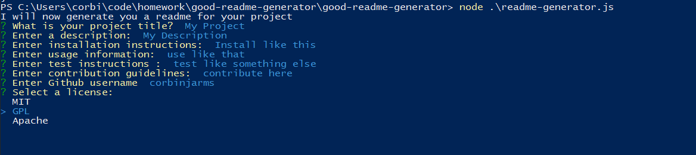

# Table of Contents
## * [Installation](#installation-instructions)
## * [Usage](#usage-information)
## * [Test](#test-instructions)
## * [Contribution](#contribution-guidelines)
## * [Questions](#Questions?)
# Good Readme Generator
##### In this project I built a readme generator with node.js and the inquirer package to allow a user to answer a series of questions and generate a good readmeIn this project I built a readme generator with node.js and the inquirer package to allow a user to answer a series of questions and generate a good readme
## Installation Instructions
##### Use Node.js and inquirer package
## Usage Information
##### use a terminal to generate the readme
## Test Instructions
##### 
## Contribution Guidelines
##### contact me to contribute
# Questions?
## Username
##### corbinjarms
## Contact Information
##### corbin@corbinjarms.com

© 2019 Trilogy Education Services, a 2U, Inc. brand. All Rights Reserved.
